# pass.android

> Modern Android autofill for your [`pass`](https://www.passwordstore.org/) password store — biometric-gated, read-only, syncs over SSH.

## Motivation

I use [`pass`](https://www.passwordstore.org/), the standard Unix password store, and I wanted a phone client that fit my own workflow: passwords live in a git repo, get written from my laptop, and get _read_ on my phone — mostly through autofill.

Three things pushed me to build this:

- **First-class modern autofill.** I wanted deep integration with the current Android credential stack — `AutofillService`, Credential Manager (Android 14+), and Android 16's Identity Check biometric-only enforcement — not a bolt-on.
- **Different scope from existing clients.** [Android Password Store (APS)](https://github.com/android-password-store/Android-Password-Store) was archived on **Oct 15, 2024**; [an active fork](https://github.com/agrahn/Android-Password-Store) continues it as a full-featured read/write client. Neither targets the modern Android credential stack the way this app does.
- **Built for my flow.** This is a personal project shaped around how I actually use `pass`: read on the phone, write on the laptop.

It's a personal-use project first. But if you're a `pass` user looking for a maintained, autofill-first Android client, it may fit you too.

## Objectives

What the app does:

- **Onboard** — generate an on-device SSH keypair for git auth, import your existing GPG key, and optionally reuse an authentication `[A]` subkey if one is available.
- **Sync** — clone and pull your `pass` repo from a git remote over SSH. Conflict resolution is intentionally out of scope because the app is read-only.
- **Browse & search** — list all entries with directory structure preserved; fuzzy, case-insensitive search.
- **Decrypt & view** — GPG-decrypt an entry behind a biometric prompt, show password and notes.
- **Autofill** — surface credentials to the system via `AutofillService` (Android 8+), inline suggestions (Android 11+) and Credential Manager (Android 14+).
- **Manage** — session timeout, manual lock, manual sync, and clear-all-data, in settings.

## Screenshots

|                                   Welcome                                    |                    |                                 Import GPG key                                  |
| :--------------------------------------------------------------------------: | :----------------: | :-----------------------------------------------------------------------------: |
| 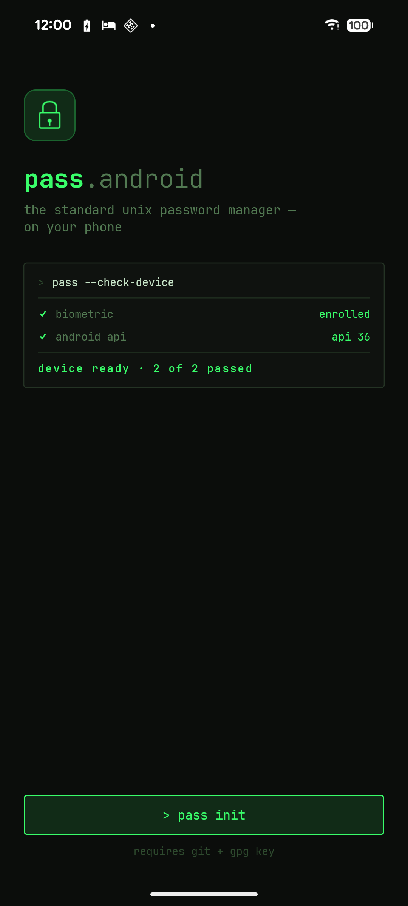 | &nbsp;&nbsp;&nbsp; | 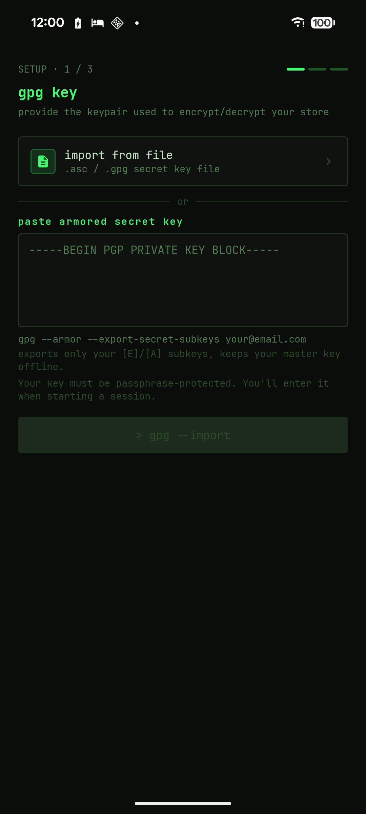 |

|                                     Key loaded                                      |                    |                                    Key imported                                     |
| :---------------------------------------------------------------------------------: | :----------------: | :---------------------------------------------------------------------------------: |
| 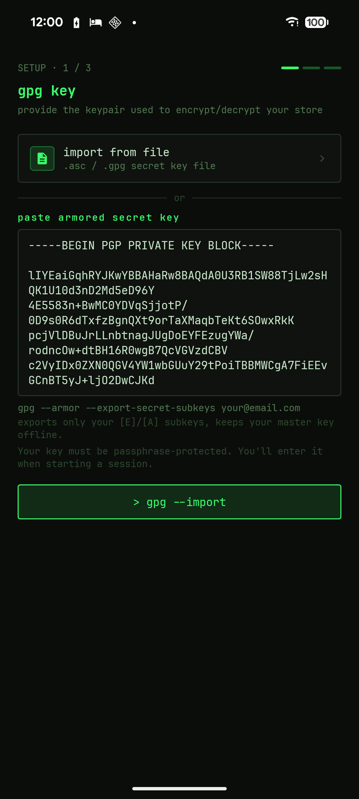 | &nbsp;&nbsp;&nbsp; | 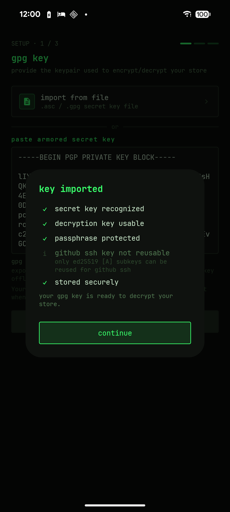 |

|                                       Clone repo                                        |                    |                                   Clone progress                                    |
| :-------------------------------------------------------------------------------------: | :----------------: | :---------------------------------------------------------------------------------: |
| 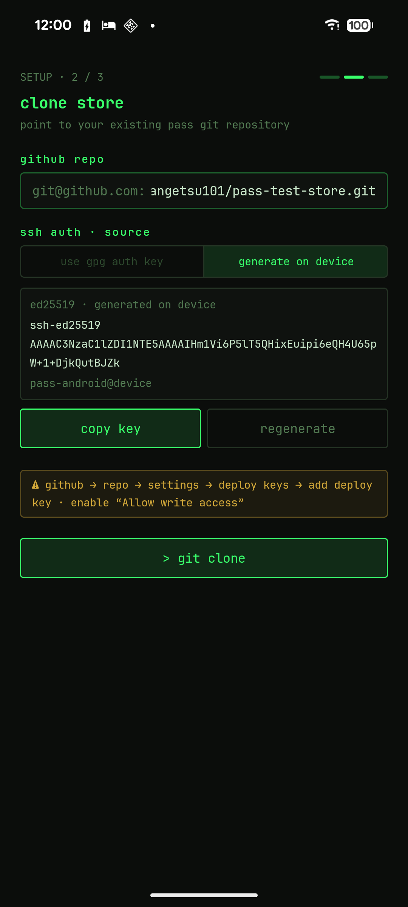 | &nbsp;&nbsp;&nbsp; | 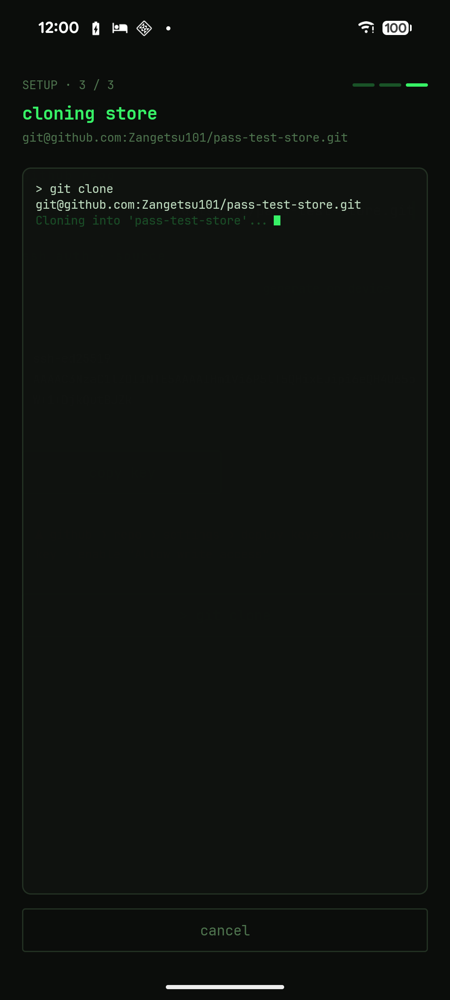 |

|                                         Entry browser                                         |                    |                                        Session start                                        |
| :-------------------------------------------------------------------------------------------: | :----------------: | :-----------------------------------------------------------------------------------------: |
| 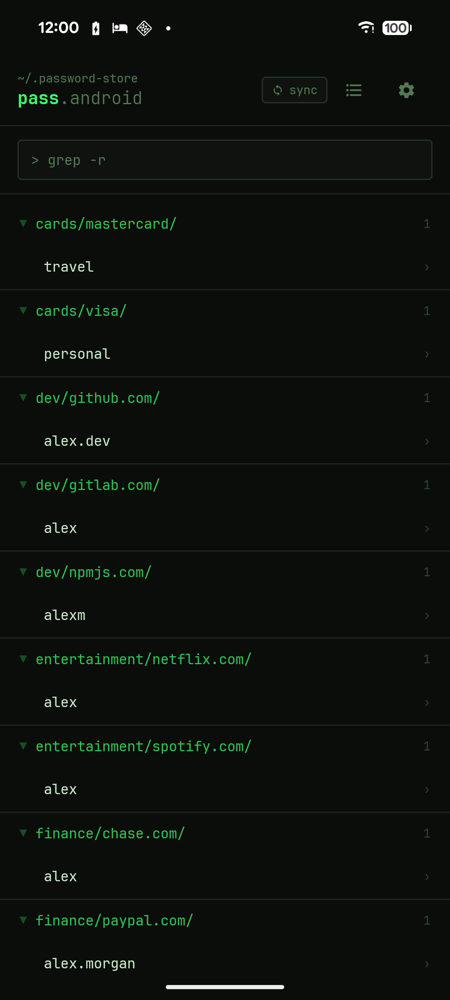 | &nbsp;&nbsp;&nbsp; | 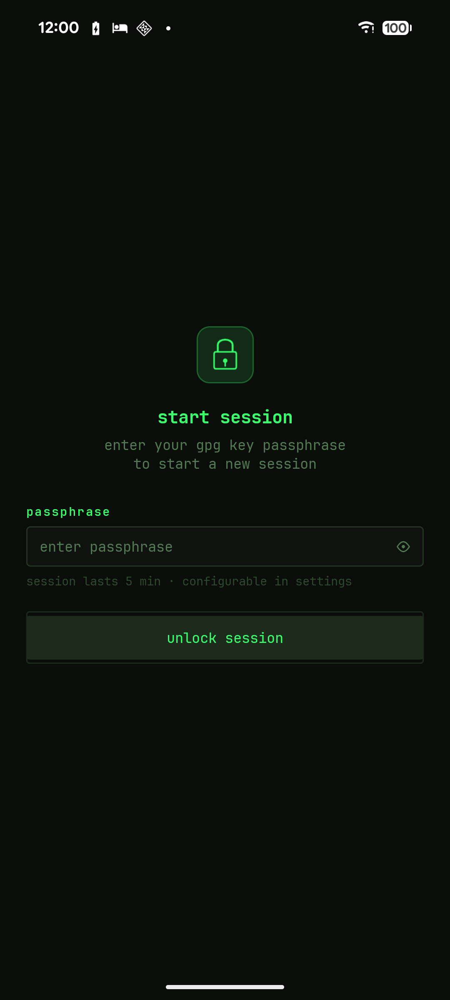 |

|                                          Entry detail                                          |                    |                                                      Password revealed                                                       |
| :--------------------------------------------------------------------------------------------: | :----------------: | :--------------------------------------------------------------------------------------------------------------------------: |
| 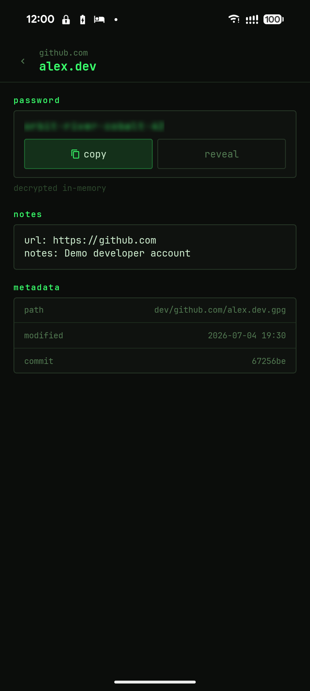 | &nbsp;&nbsp;&nbsp; | 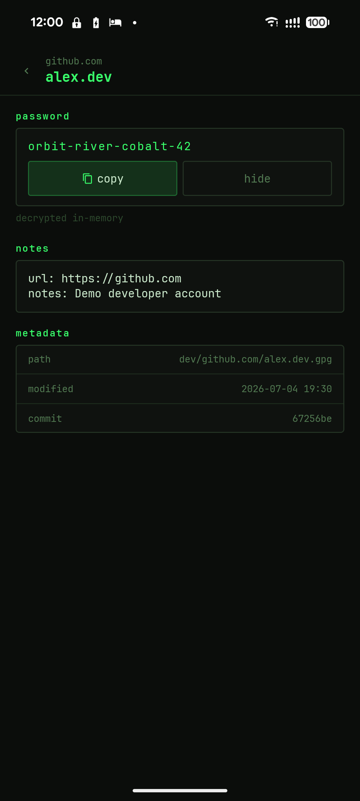 |

|                                Settings                                 |
| :---------------------------------------------------------------------: |
| 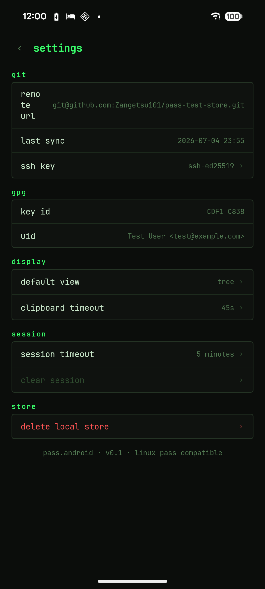 |

## Goals

Design principles the app is judged against:

- **Security-first** — biometric required per fill, keys wrapped by a hardware-backed Keystore key, decrypted secrets never written to disk, clipboard auto-cleared, timed session lock.
- **Offline-first** — fully functional after the first sync; local git clone, decrypt on demand, no network needed to read.
- **Modern-Android-native** — built on Jetpack Compose, Credential Manager, and Android 16 Identity Check — not a legacy-API port.
- **`pass`-compatible** — standard store layout, GPG, and git remote; no proprietary format, your existing store works as-is.
- **Terminal-themed** — monospace, terminal-inspired UI that mirrors the `pass` CLI aesthetic.

## Future work

- **OTP / `pass-otp` support:** I plan to move my own 2FA secrets into `pass` and add TOTP autofill support.
- **Considering:** write support (create/edit entries), HTTPS git authentication.

## Scope

This is read-only (v1) and intentionally narrow. See [`architecture/architecture.md`](architecture/architecture.md) for the full architecture and out-of-scope list.
